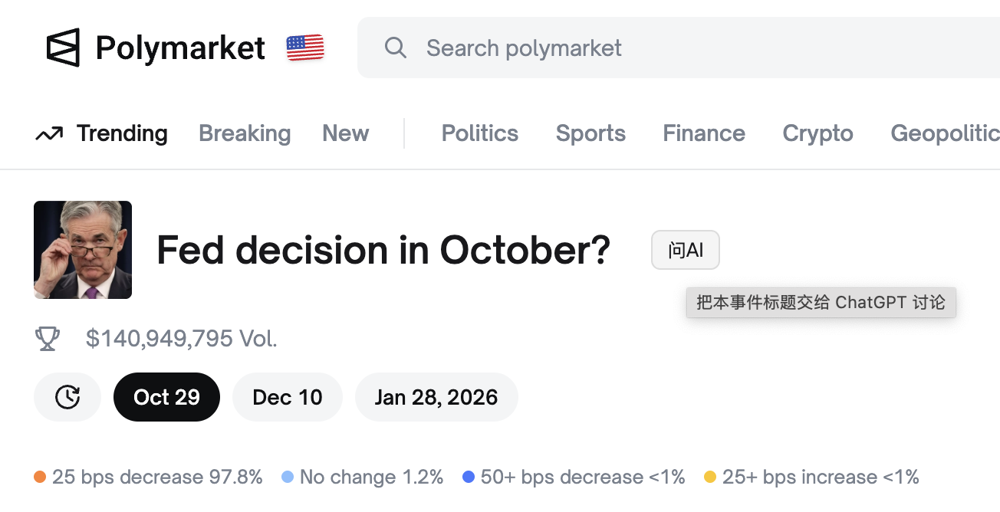

# PolyHelper 插件安装指南

## 项目简介
PolyHelper 是一个面向 Polymarket 的浏览器辅助插件，会在事件页面标题旁生成“问AI”按钮，帮助你快速复制结构化提问并跳转到 ChatGPT 进行讨论。

## 获取代码压缩包
1. 打开项目主页：`https://github.com/discountry/polyhelper`。
2. 点击页面右上角的 `Code` 按钮，选择 `Download ZIP`。
3. 将下载得到的 `polyhelper-main.zip`（文件名可能随分支而变化）保存到本地，并解压到便于管理的目录，例如 `~/Downloads/polyhelper/`。

## 在 Chrome 中加载插件
1. 打开浏览器地址栏输入 `chrome://extensions/` 进入插件管理。
2. 右上角开启“开发者模式”开关。
3. 点击“加载已解压的扩展程序”，选择刚刚解压后的 `polyhelper` 文件夹（包含 `manifest.json` 与 `content.js`）。
4. 确认插件已出现在扩展列表中并保持启用状态。

## 查看插件效果
1. 打开或刷新 `https://polymarket.com/event/...` 的任意事件页面。
2. 页面标题旁会出现“问AI”按钮。
3. 点击按钮后，插件会自动复制包含事件标题与链接的中文提问模板，并在新标签页打开 ChatGPT，方便你直接粘贴对话。

## 功能亮点
- 快速复制结构化提问内容，覆盖事件判定、双方观点、催化与交易思路等要点。
- 自动跳转 ChatGPT，减少手动切换与编辑的步骤。
- 纯前端实现，无需额外依赖或构建流程，直接以解压目录方式加载即可使用。
